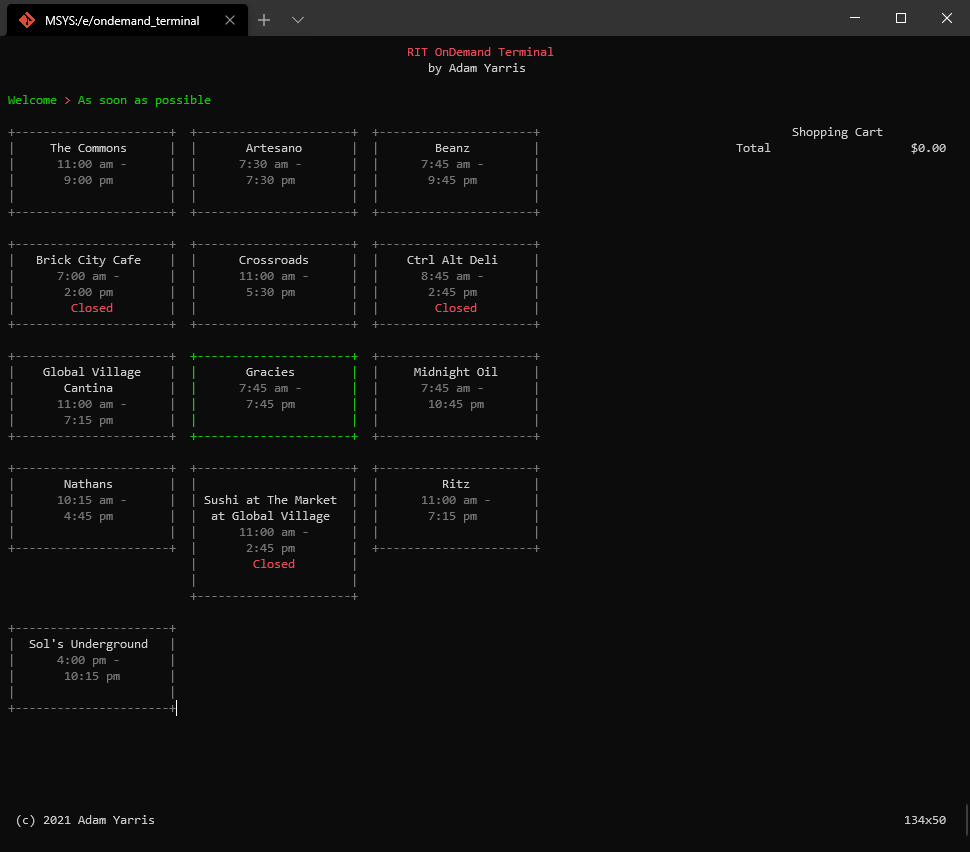
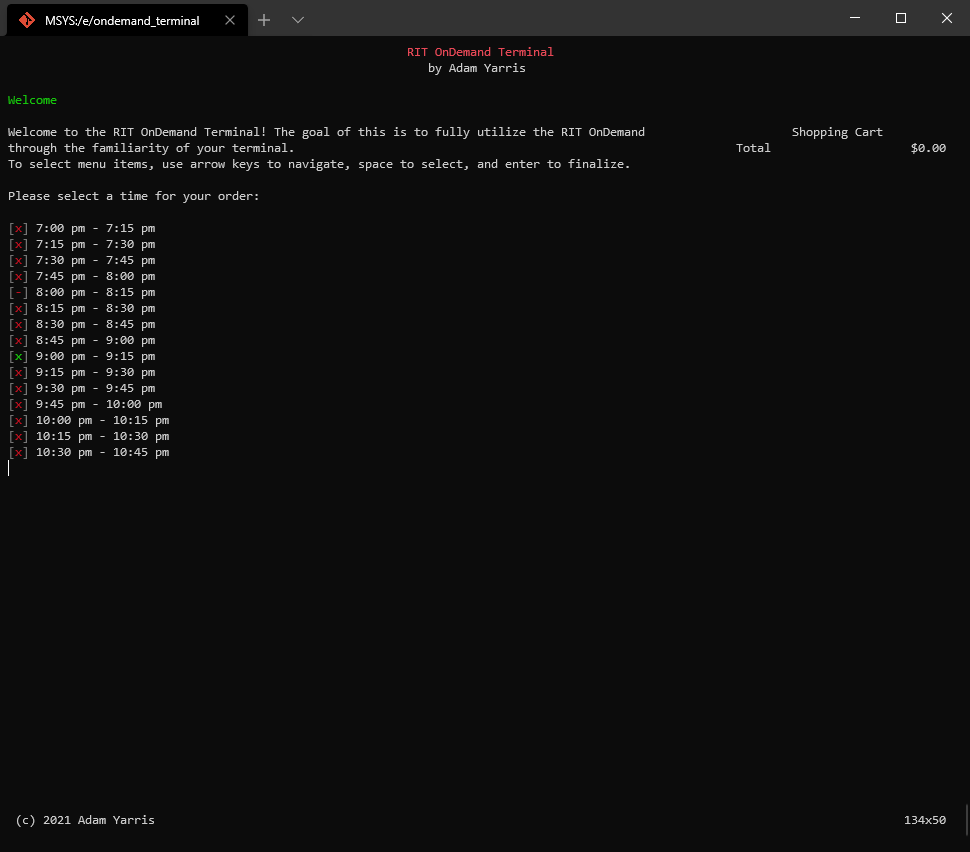

## OnDemand Terminal

Wow, another OnDemand repo, surprise surprise. This uses a [generated](https://github.com/RubbaBoy/ondemand_wrapper_gen) [Dart wrapper](https://github.com/RubbaBoy/ondemand) of the internal API of Agilysys OnDemand, used at RIT. It is an attempt at recreating the entire https://ondemand.rit.edu/ website in a terminal interface, primarily as a working ground to kick off future applications using the API.

Some WIP screenshots:

